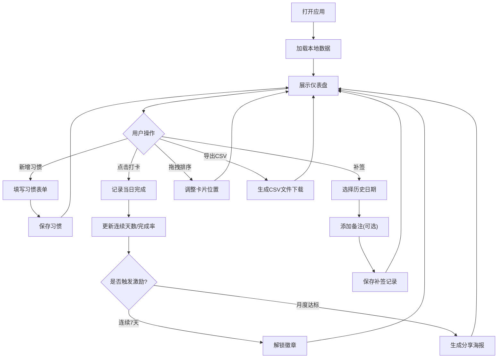

## 1. 产品概述

个人习惯追踪仪表盘，帮助用户建立和维持良好的日常习惯。通过卡片式布局展示各习惯进度，结合数据可视化、激励机制和社交分享功能，让用户坚持习惯变得更有趣、更有成就感。

- 核心目标：降低习惯养成门槛，通过数据反馈和激励机制提升用户粘性
- 目标用户：希望建立规律生活、提升自我管理能力的个人用户
- 产品价值：用可视化数据直观呈现习惯进度，通过徽章和分享机制强化正向反馈

## 2. 核心功能

### 2.1 用户角色
| 角色 | 注册方式 | 核心权限 |
|------|---------|---------|
| 普通用户 | 无需注册，本地使用 | 所有功能，数据存储于本地 LocalStorage |

### 2.2 功能模块
1. **习惯管理**：创建/编辑/删除习惯目标，设置频率（每日/每周）、目标次数、分组、优先级
2. **打卡系统**：一键打卡、历史补签、备注记录
3. **数据看板**：连续打卡天数、本月完成率、热力图日历
4. **数据可视化**：折线图（习惯完成趋势）、柱状图（各习惯对比）
5. **排序与分组**：优先级排序、自定义分组、拖拽调整卡片位置
6. **激励机制**：连续打卡 7 天解锁徽章、达成月度目标生成分享海报
7. **系统设置**：深色模式切换、CSV 数据导出/备份

### 2.3 页面详情
| 页面名称 | 模块名称 | 功能描述 |
|---------|---------|---------|
| 主仪表盘 | 顶部导航栏 | 标题、深色模式切换、CSV 导出、新增习惯按钮 |
| 主仪表盘 | 统计概览区 | 总习惯数、今日完成数、总打卡天数、已获得徽章数 |
| 主仪表盘 | 图表分析区 | 完成趋势折线图、习惯对比柱状图 |
| 主仪表盘 | 习惯卡片区 | 可拖拽卡片网格，每个卡片展示习惯详情、热力图、打卡按钮 |
| 新增/编辑弹窗 | 习惯表单 | 名称、图标、频率、目标次数、分组、优先级、颜色 |
| 补签/备注弹窗 | 日期选择器 | 选择历史日期补签，添加备注信息 |
| 徽章展示 | 徽章墙 | 已解锁徽章列表、解锁条件 |
| 海报弹窗 | 分享海报 | 月度成就海报预览、下载保存 |

## 3. 核心流程

### 主用户流程
用户打开应用 → 查看仪表盘概览 → 点击习惯卡片上的打卡按钮完成当日记录 → 查看热力图和统计数据 → 连续打卡获得徽章 → 月度达标生成分享海报

## 4. 用户界面设计

### 4.1 设计风格
- **主色调**：温暖的渐变橙红色系（#FF6B6B → #FF8E53）作为主题色，搭配青绿色（#4ECDC4）作为辅助强调色
- **中性色**：采用 Slate 色系，浅色模式以柔和米白为底，深色模式以深邃炭灰为主
- **按钮风格**：圆角胶囊按钮，带有微渐变和阴影，hover 时有轻微上浮动画
- **字体**：显示字体使用 "Poppins" 搭配现代无衬线字体，正文字体使用系统字体栈
- **布局风格**：卡片式网格化布局，卡片带有柔和阴影和圆角，卡片间留有舒适呼吸空间
- **图标风格**：使用 Lucide 线性图标，统一 24px 尺寸，搭配主题色填充
- **动效**：页面加载时有错落淡入动画，打卡按钮有弹性反馈，热力图格子有悬浮高亮效果

### 4.2 页面设计概览
| 页面名称 | 模块名称 | UI 元素 |
|---------|---------|---------|
| 主仪表盘 | 顶部导航 | 渐变 Logo、玻璃拟态导航栏、深色模式切换开关、导出按钮（带动画）、新增习惯主按钮 |
| 主仪表盘 | 统计概览 | 4 个统计卡片，每个带图标和渐变背景条，数值使用大号显示字体 |
| 主仪表盘 | 图表区域 | 两个并排图表容器，带标题和说明文字，响应式布局 |
| 主仪表盘 | 习惯卡片网格 | CSS Grid 响应式网格，卡片可拖拽（拖拽时半透明+阴影加深） |
| 习惯卡片 | 卡片头部 | 图标+名称+分组标签、优先级角标、操作菜单（编辑/删除） |
| 习惯卡片 | 统计区 | 连续天数火焰图标、完成率环形进度条 |
| 习惯卡片 | 热力图 | 7列多行小方格，颜色深浅表示完成状态，hover 显示日期和备注 |
| 习惯卡片 | 打卡区 | 大号圆形打卡按钮，已完成状态显示勾选动效 |
| 弹窗 | 模态层 | 半透明模糊背景，弹窗带圆角和阴影，进入时缩放淡入动画 |

### 4.3 响应式设计
- **桌面端**（≥1024px）：统计卡片 4 列，图表区域 2 列，习惯卡片网格 2-3 列
- **平板端**（768px-1023px）：统计卡片 2 列，图表区域纵向堆叠，习惯卡片网格 2 列
- **移动端**（<768px）：统计卡片 2 列或纵向堆叠，图表区域单列，习惯卡片单列全宽
