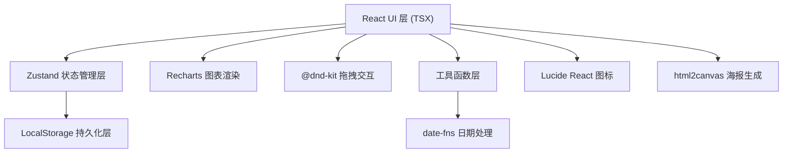
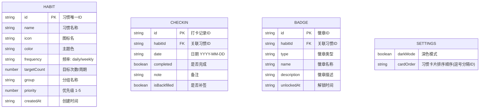

## 1. 架构设计



## 2. 技术描述
- **前端**：React 18 + TypeScript + Vite 5
- **样式方案**：Tailwind CSS 3 + CSS 变量主题系统
- **状态管理**：Zustand（内置 persist 中间件实现 LocalStorage 持久化）
- **图表库**：Recharts（React 生态最成熟的图表方案，基于 SVG）
- **拖拽库**：@dnd-kit/core + @dnd-kit/sortable（现代、轻量、可访问性好）
- **日期处理**：date-fns（轻量、函数式、Tree-shakable）
- **图标**：lucide-react
- **海报生成**：html2canvas（将 DOM 转为 Canvas 再导出图片）
- **构建工具**：Vite 5
- **数据库**：无后端，使用 LocalStorage 持久化，支持 CSV 导出备份

## 3. 路由定义
| 路由 | 用途 |
|------|------|
| / | 主仪表盘（单页应用，无其他路由） |

## 4. 数据模型

### 4.1 数据模型定义



### 4.2 TypeScript 类型定义

```typescript
type Frequency = 'daily' | 'weekly';

interface Habit {
  id: string;
  name: string;
  icon: string;
  color: string;
  frequency: Frequency;
  targetCount: number;
  group: string;
  priority: number;
  createdAt: string;
}

interface CheckIn {
  id: string;
  habitId: string;
  date: string;
  completed: boolean;
  note: string;
  isBackfilled: boolean;
}

interface Badge {
  id: string;
  habitId: string;
  type: 'streak_7' | 'streak_30' | 'monthly_perfect' | 'first_checkin';
  name: string;
  description: string;
  unlockedAt: string;
}

interface AppSettings {
  darkMode: boolean;
  cardOrder: string[];
}

interface AppStore {
  habits: Habit[];
  checkIns: CheckIn[];
  badges: Badge[];
  settings: AppSettings;
  
  addHabit: (habit: Omit<Habit, 'id' | 'createdAt'>) => void;
  updateHabit: (id: string, updates: Partial<Habit>) => void;
  deleteHabit: (id: string) => void;
  
  toggleCheckIn: (habitId: string, date: string, note?: string, isBackfilled?: boolean) => void;
  updateCheckInNote: (checkInId: string, note: string) => void;
  
  reorderCards: (newOrder: string[]) => void;
  toggleDarkMode: () => void;
  
  exportCSV: () => string;
  checkAndUnlockBadges: (habitId: string) => void;
}
```

## 5. 项目目录结构

```
src/
├── components/
│   ├── HabitCard.tsx          # 单个习惯卡片
│   ├── HabitForm.tsx          # 新增/编辑习惯表单
│   ├── Heatmap.tsx            # 热力图日历
│   ├── StatsOverview.tsx      # 统计概览卡片组
│   ├── TrendChart.tsx         # 趋势折线图
│   ├── CompareChart.tsx       # 对比柱状图
│   ├── CheckInModal.tsx       # 补签/备注弹窗
│   ├── BadgeGallery.tsx       # 徽章展示墙
│   ├── SharePoster.tsx        # 分享海报
│   ├── Navbar.tsx             # 顶部导航栏
│   └── ui/                    # 基础 UI 组件
│       ├── Button.tsx
│       ├── Modal.tsx
│       └── ProgressRing.tsx
├── hooks/
│   └── useHabitStats.ts       # 习惯统计计算 hook
├── store/
│   └── useAppStore.ts         # Zustand 全局状态
├── types/
│   └── index.ts               # 类型定义
├── utils/
│   ├── date.ts                # 日期工具
│   ├── stats.ts               # 统计计算
│   ├── csv.ts                 # CSV 导出
│   └── badges.ts              # 徽章逻辑
├── App.tsx
├── main.tsx
└── index.css
```

## 6. 关键实现策略

### 6.1 LocalStorage 持久化
使用 Zustand 的 `persist` 中间件，自动将 store 状态序列化存储到 LocalStorage，key 为 `habit-tracker-data`。

### 6.2 热力图实现
生成最近 12 周的日期网格，按完成次数映射到 4 级颜色深度，使用 CSS Grid 布局，hover 显示 tooltip。

### 6.3 连续天数计算
从今日向前遍历，遇到某日无打卡记录则中断，计算连续打卡的天数。

### 6.4 拖拽排序
使用 @dnd-kit/sortable，拖拽结束后更新 settings.cardOrder 数组。

### 6.5 徽章检测
每次打卡后调用 checkAndUnlockBadges，检查连续天数和月度完成率是否满足解锁条件。

### 6.6 海报生成
使用 html2canvas 将隐藏的海报 DOM 节点转为 canvas，再导出为 PNG 图片供下载。
